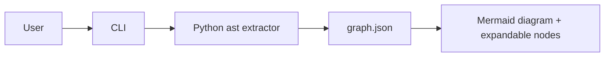

# CodeAtlas

CodeAtlas turns a local Python repository into an honest, explorable architecture diagram.

## What it solves

Reading an unfamiliar codebase means reconstructing modules, ownership, and risky paths from scattered files. Static analysis is imperfect, so CodeAtlas exposes its confidence level and labels heuristic bottlenecks instead of pretending every inferred relationship is certain.

## MVP scope

The MVP statically parses Python with the standard-library `ast` module; it never imports or executes the target repository. It extracts modules, classes, functions, imports, calls, and three deliberately small bottleneck heuristics: same-collection nested loops, blocking I/O in a loop, and query-like calls in a loop.

JS/TS support is intentionally deferred. Dynamic dispatch, reflection, generated code, and cross-language resolution are known limitations.

## Run

```bash
pip install -r requirements.txt
python -m analyzer.cli analyze ./fixtures/sample_repo_with_bottlenecks --out frontend/graph.json
python -m http.server 8000 --directory frontend
```

Open [http://localhost:8000](http://localhost:8000), then click nodes to reveal their direct children. Alternatively, open `frontend/index.html` and select the generated `graph.json` file.

## Test

```bash
python -m pytest tests -v
```

## Architecture



## Tech

Python, standard-library `ast`, pytest, Mermaid, and vanilla JavaScript.

## Built with Codex

OpenAI Codex accelerated the initial AST traversal, fixture-driven bottleneck rules, graph contract, and the no-build frontend. The key product choice was a Python-only static MVP: dependable, transparent output beats broad but unreliable language coverage for a demo.

## Hackathon notes

The fixture repositories let judges test the tool immediately. Add the public repository URL, hosted demo URL, and user-produced video link before submission.
