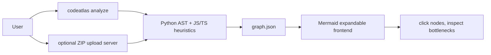

# CodeAtlas

CodeAtlas turns a local repository into an honest, explorable architecture map.

## Problem

Understanding an unfamiliar codebase is slow because structure is scattered across files, imports, call sites, and route handlers. Static analysis is never perfect, so CodeAtlas shows confidence instead of pretending every inferred relationship is certain.

## Solution

CodeAtlas parses Python with the standard-library `ast` module, adds lightweight JS/TS heuristics, emits a `graph.json`, and renders it as an expandable Mermaid diagram. It also flags three performance-risk patterns directly on the diagram: same-collection nested loops, blocking I/O inside loops, and query-like calls inside loops.

## Quick start

```bash
pip install -r requirements.txt
python -m analyzer.cli analyze ./fixtures/sample_repo_with_bottlenecks --out frontend/graph.json
python server.py
```

Open [http://localhost:8001](http://localhost:8001). You can upload a project ZIP with the local server, or open `frontend/index.html` directly and upload a generated `graph.json` on static hosting.

## Test

```bash
python -m pytest tests -v
```

## Supported scope

- Python: modules, classes, functions, imports, calls, and common route decorators.
- JS/TS: best-effort imports, function declarations, arrow functions, and Express-style routes.
- Confidence: Python AST nodes are high confidence; JS/TS regex nodes are medium or low confidence.
- Limitations: dynamic dispatch, reflection, generated code, deep framework magic, and arbitrary monorepos are out of scope for the MVP.

## Architecture



## Tech stack

Python, stdlib `ast`, stdlib `http.server`, pytest, Mermaid, and vanilla JavaScript. No OpenAI API key or model call is required to run the prototype, so judge testing costs zero credits.

## How Codex was used

OpenAI Codex was the primary development partner for the MVP: it helped shape the graph contract, implement the AST traversal, add fixture-driven bottleneck tests, and keep the frontend no-build and demo-safe. The key decision was to ship a transparent static-analysis tool first, then visibly label heuristic JS/TS support rather than oversell accuracy.

## Demo and submission links

- Hosted prototype: TODO
- Demo video: TODO
- Public repository: TODO
- Track: Developer Tools
- License: MIT

See `DEVPOST.md` for the copy/paste submission description and 3-minute demo outline.

## One-command judge path

```bash
python -m analyzer.cli analyze ./fixtures/sample_repo_with_bottlenecks --out frontend/graph.json && python server.py
```

Then open [http://localhost:8001](http://localhost:8001), click `bottlenecks`, and inspect the red-highlighted `slow` function.
